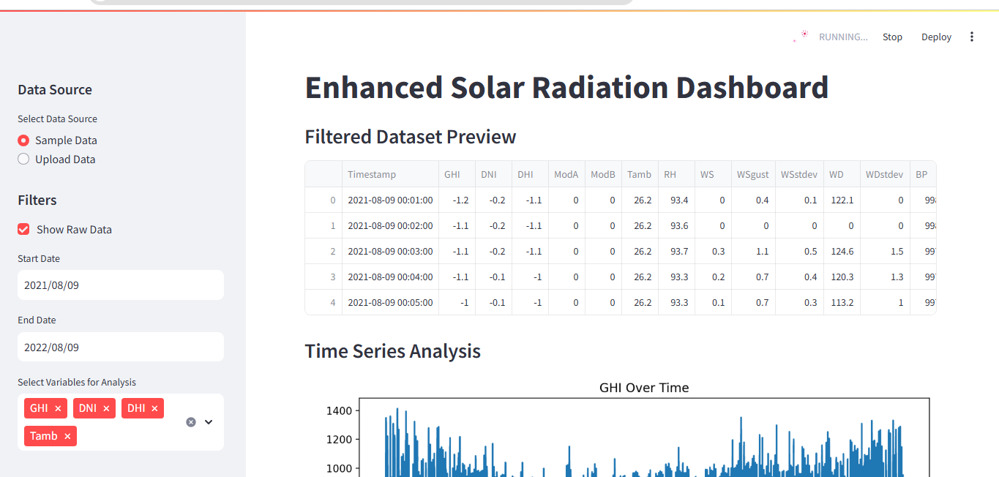
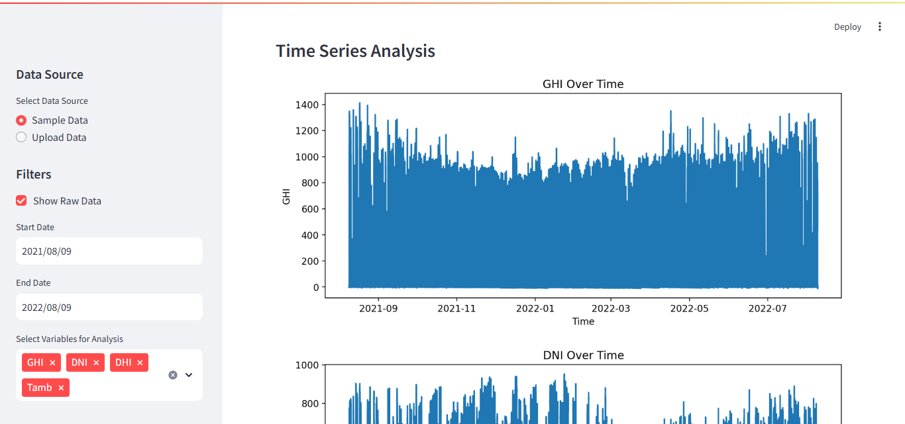
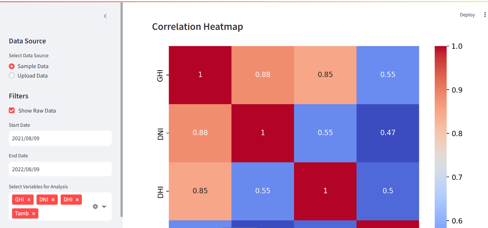
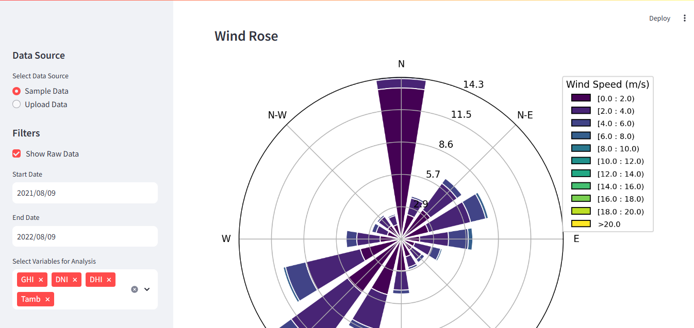
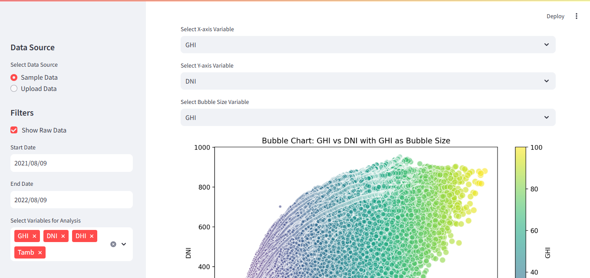

# Solar Radiation Dashboard

## Overview
This project implements an interactive Streamlit dashboard to visualize and analyze solar radiation data. The dashboard provides insights into key variables like GHI, DNI, DHI, and other environmental factors, enabling users to explore patterns and identify trends dynamically.

## Features
- **Interactive Filters:**
  - Time range filter to focus on specific periods.
  - Variable selection for targeted analysis.
  - Data upload functionality to analyze custom datasets.
- **Visualizations:**
  - Time series plots for selected variables.
  - Correlation heatmap to explore relationships between variables.
  - Wind rose visualization for wind direction and speed.
  - Bubble chart to analyze complex relationships.
- **Data Insights:**
  - Z-score analysis for outlier detection.
  - Summary statistics.
- **User-Friendly Interface:**
  - Sidebar navigation for easy interaction.
  - Responsive visualizations.

## Installation
1. Clone the repository:
   ```bash
   git clone https://github.com/tesfaymebre/Solar-radiation-data-analysis.git
   ```
2. Navigate to the project directory:
   ```bash
   cd Solar-radiation-data-analysis
   ```
3. Install dependencies:
   ```bash
   pip install -r requirements.txt
   ```

## Usage
1. Run the Streamlit app:
   ```bash
   streamlit run app/main.py
   ```
2. Open the provided local URL in your browser.

## Project Structure
```
├── app/
│   ├── main.py         # Streamlit dashboard script
├── data/
│   ├── benin-malanville.csv  # Dataset (default dataset)
├── requirements.txt
├── README.md
```

## Dataset
The dataset contains solar radiation measurements and environmental parameters:
- **Columns:**
  - `Timestamp`: Date and time of observations.
  - `GHI`: Global Horizontal Irradiance (W/m²).
  - `DNI`: Direct Normal Irradiance (W/m²).
  - `DHI`: Diffuse Horizontal Irradiance (W/m²).
  - `Tamb`: Ambient Temperature (°C).
  - `RH`: Relative Humidity (%).
  - `WS`: Wind Speed (m/s).
  - `WD`: Wind Direction (°N).

## How to Use
### Sidebar Controls
- **Data Source Selection:** Choose between sample data or upload your own CSV file.
- **Raw Data Preview:** Toggle to display the first few rows of the dataset.
- **Time Range Filter:** Select a date range to narrow the analysis.
- **Variable Selector:** Choose variables to include in the analysis.

### Visualizations
1. **Time Series Plots:**
   - Explore trends over time for selected variables.
2. **Correlation Heatmap:**
   - Analyze relationships between variables.
3. **Wind Rose:**
   - Visualize wind speed and direction distribution.
4. **Bubble Chart:**
   - Analyze complex relationships with interactive bubble sizes.
5. **Z-Score Analysis:**
   - Identify and examine outliers.

## Dependencies
- Python 3.7+
- Streamlit
- Pandas
- Matplotlib
- Seaborn
- Windrose

## Contributing
1. Fork the repository.
2. Create a feature branch:
   ```bash
   git checkout -b feature-name
   ```
3. Commit your changes:
   ```bash
   git commit -m 'Add feature-name'
   ```
4. Push to the branch:
   ```bash
   git push origin feature-name
   ```
5. Open a Pull Request.


## Sample screen shots





